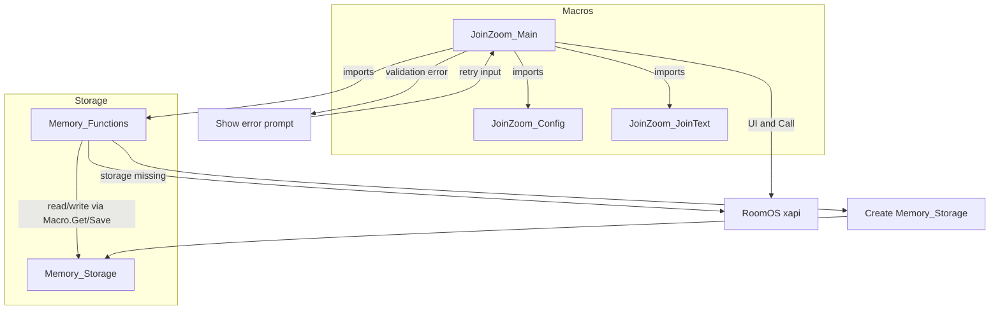
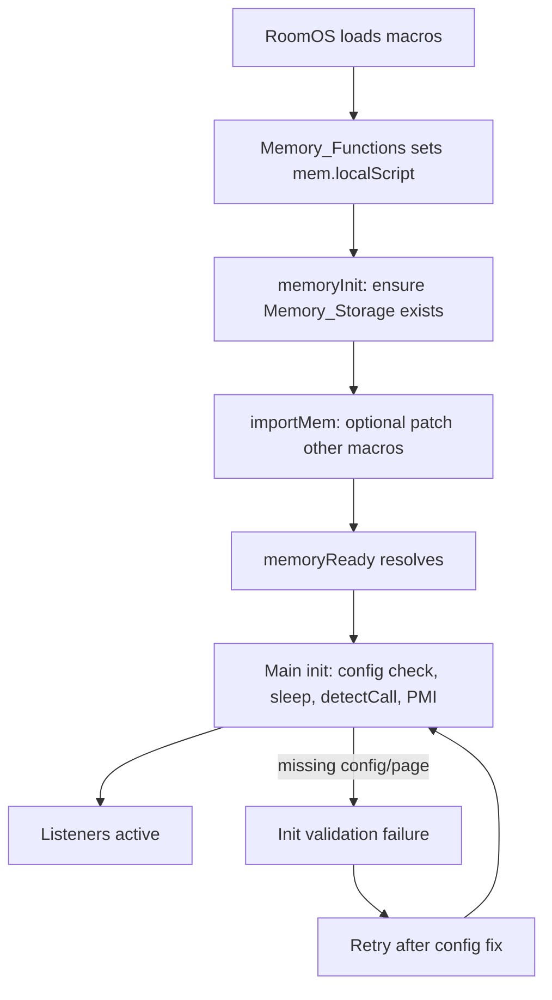

# Join-Zoom Macro · QuickJS Migration Fix

**This repository is archived.** See [ARCHIVE.md](ARCHIVE.md) for the archive notice, preserved structure, and validation commands.

Resolve the `ReferenceError: 'module' is not defined` error on Cisco RoomOS 11.28+ by migrating legacy macros to ES Modules.

> **Note:** Cisco provides an official **Zoom Room Connector / Zoom plugin** for RoomOS devices. For new deployments, prefer using Cisco’s native Zoom integration instead of this community macro. This repository is intended for existing installations that already rely on the Join Zoom macro suite and need a compatibility fix for RoomOS 11.28+ (QuickJS).

## Overview

RoomOS 11.28 replaced the legacy Duktape runtime with QuickJS and removed CommonJS globals (`module`, `exports`, `require`, `__filename`, ...). Legacy macros that call `module.name` fail to load. This repo provides a safe, backward-compatible fix and a patched `Memory_Functions.js` for Join Zoom 4-1-1. The tracked files are release-ready; local artifacts (e.g. `FINDINGS.md`) are gitignored and not part of the release. See [ARCHIVE.md](ARCHIVE.md) for the canonical file list.

## How it works

The Join Zoom macro suite is made of several pieces: the main macro drives the UI and call flow; the Config macro supplies dial logic, regex, and settings; the JoinText macro supplies prompts and copy; Memory_Functions provides scoped and global persistent storage; and the Memory_Storage macro (created by Memory_Functions if missing) holds the stored data. The main macro imports Config, JoinText, and Memory_Functions, and uses the RoomOS `xapi` for UI and placing calls.



The main macro imports config/text/memory helpers and drives RoomOS UI plus call placement through `xapi`. Validation errors (meeting ID, passcode, or role) stay in the prompt flow until corrected, instead of proceeding to dial. Memory storage failures are handled by recreating the storage macro path before continuing normal reads/writes.

## Lifecycle

Startup runs in order: RoomOS loads macros; Memory_Functions sets `mem.localScript` (from `import.meta.url` or `module.name` fallback), then runs `memoryInit()` (ensures the Memory_Storage macro exists), then `importMem()` if enabled (patches other macros’ imports). When the `memoryReady` promise resolves, JoinZoom_Main’s `init()` runs: it validates config and page, sleeps 5s, registers call detection and Zoom Tools visibility, applies JoinWebex config, and reads or initializes PMI. Event listeners (Panel Clicked, TextInput, Prompt, Widget Action, Call status, CallDisconnect) are registered at load and are active once init has run.



Lifecycle execution begins at macro load, prepares memory compatibility, then enables UI/event listeners once init succeeds. If init validation fails, execution follows an explicit recovery path and retries after config correction. During runtime, panel and prompt events gather meeting info; widget actions trigger `dialZoom()`, and disconnect events reset state for the next call.

## Features

- Works on RoomOS ≤ 11.27 (Duktape) and ≥ 11.28 (QuickJS).
- Universal replacement for `module.name` using `import.meta.url`.
- Optional scoped memory API to avoid cross-macro race conditions.
- Offline linting and tests via a local `xapi` stub.

## Requirements

- Cisco RoomOS macros environment for deployment.
- Node.js 18+ for local lint/test.
- Companion macros `JoinZoom_Config_4-1-1` and `JoinZoom_JoinText_4-1-1` (not included here).

## Quickstart

1. Open Macro Editor and update `Memory_Functions.js` using the snippet below.
2. Update `JoinZoom_Main_4-1-1.js` to use the new memory helper.
3. Search all macros for `module.name` and replace with the universal snippet.
4. Restart all macros.
5. Verify the UI loads and no `ReferenceError` appears in logs.

## Universal replacement snippet

```js
/* Sets mem.localScript in every firmware version */
mem.localScript = (typeof import.meta !== 'undefined' && import.meta.url)
  ? import.meta.url.split('/').pop().replace(/\.js$/i, '')      // QuickJS / ES Modules
  : (typeof module !== 'undefined' && module.name)              // legacy Duktape
  || 'UnknownScript';                                           // final fallback
```

## Optional: scoped memory API (recommended)

When multiple macros run concurrently, a shared `mem.localScript` can be overwritten. Use a scoped instance:

```js
import { mem, localScriptNameFrom } from './Memory_Functions';

const localScriptName = localScriptNameFrom({
  importMetaUrl: (typeof import.meta !== 'undefined' && import.meta.url) ? import.meta.url : undefined,
  moduleName: (typeof module !== 'undefined' && module.name) ? module.name : undefined
});

const localMem = mem.for(localScriptName);
// use localMem.read/write/remove instead of mem.read/write/remove
```

## Required companion macros (not included in this repo)

`JoinZoom_Main_4-1-1.js` depends on two macros that are not bundled here:

- `JoinZoom_Config_4-1-1`
- `JoinZoom_JoinText_4-1-1`

These are part of the original Cisco DevNet Join Zoom macro suite. Download them from the same source as the original macro bundle before deploying. Without them, `JoinZoom_Main_4-1-1.js` will fail to load.

## Files to patch

| File                     | Changes |
| ------------------------ | ------- |
| `Memory_Functions.js`    | Remove `mem.localScript = module.name;` and insert the universal snippet. |
| `JoinZoom_Main_4-1-1.js` | Replace the combined import + `module.name` usage; update `mem.remove.global(module.name)` to use `mem.localScript`. |
| Any other macro          | Replace all `module.name` references with the universal snippet. |

## Compatibility matrix

| Firmware                         | Patched macros | Result |
| -------------------------------- | -------------- | ------ |
| RoomOS ≤ 11.27 (Duktape)         | ✅              | Works (falls back to `module.name`) |
| RoomOS 11.28+ (QuickJS)          | ✅              | Works (uses `import.meta.url`) |
| Any firmware                     | ❌              | Fails with `ReferenceError` |

## Configuration

- `Memory_Functions.js` supports `config.autoImport` to inject required imports into other macros.
- `JoinZoom_Main_4-1-1.js` configuration lives in `JoinZoom_Config_4-1-1` (external).

## Alternatives & Successors

> This project is archived. Consider these actively maintained alternatives:

| Project | Description | Link |
|---------|-------------|------|
| Cisco OBTP | Native One Button to Push integration via Hybrid Calendar | [Cisco Docs](https://www.cisco.com/c/en/us/td/docs/voice_ip_comm/cloudCollaboration/spark/hybridservices/calendarservice) |
| Zoom Rooms Connector | Official Zoom integration for Cisco endpoints | [Zoom Support](https://support.zoom.us/hc/en-us/articles/360023724531) |
| Webex Zoom CRC | Cloud-registered Cisco devices with Zoom interop | [Webex](https://www.webex.com) |

## Development

Install dependencies:

```bash
npm ci --include=dev
```

Lint:

```bash
npm run lint
```

Run tests:

```bash
npm test
```

Full local smoke (lint + tests):

```bash
npm run smoke
```

## Testing

- Unit tests cover `Memory_Functions.js` behavior via the local `xapi` stub.
- Join Zoom UI/flow tests are deferred because required companion macros are not in this repo.

## Security

- CI runs a basic secret scan, `npm audit`, and CodeQL SAST.
- Do not log or paste sensitive values (meeting IDs, host keys, phone numbers).
- Report vulnerabilities via `SECURITY.md`.

## Troubleshooting

- `ReferenceError: 'module' is not defined`: ensure the universal snippet replaced all `module.name` references.
- `JoinZoom_Main_4-1-1.js` fails to load: install the companion macros listed above.
- Tests fail with `xapi` errors: run `npm ci` so the local `xapi` stub is installed.

## Credits

- Robert McGonigle Jr — original Join-Zoom macros
- Zacharie Gignac — Memory Functions utility
- Migration patch & README by Sebastian J. Spicker (May 2025)

## License

This documentation follows the same license as the original project. See `LICENSE` for details.
